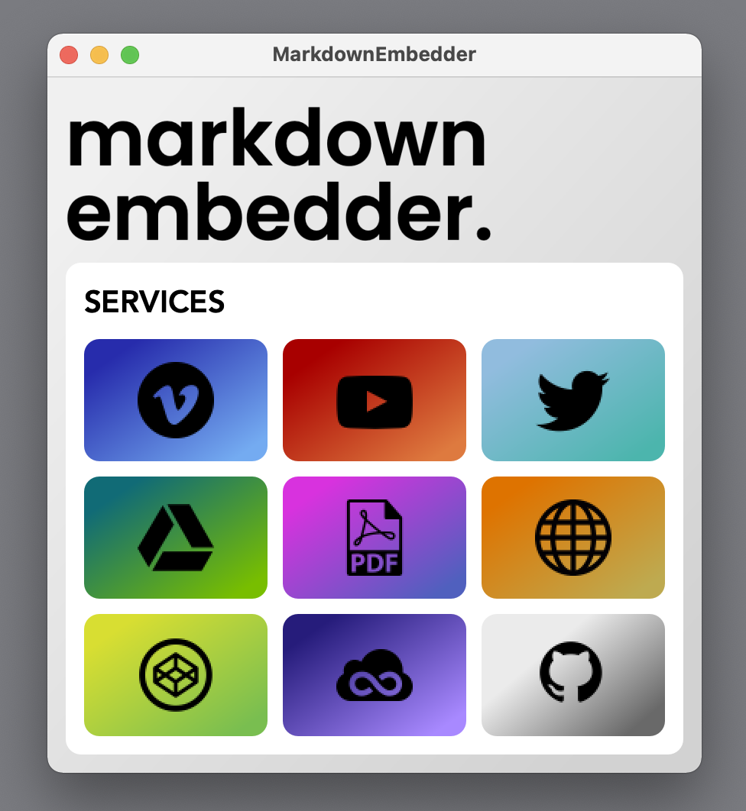
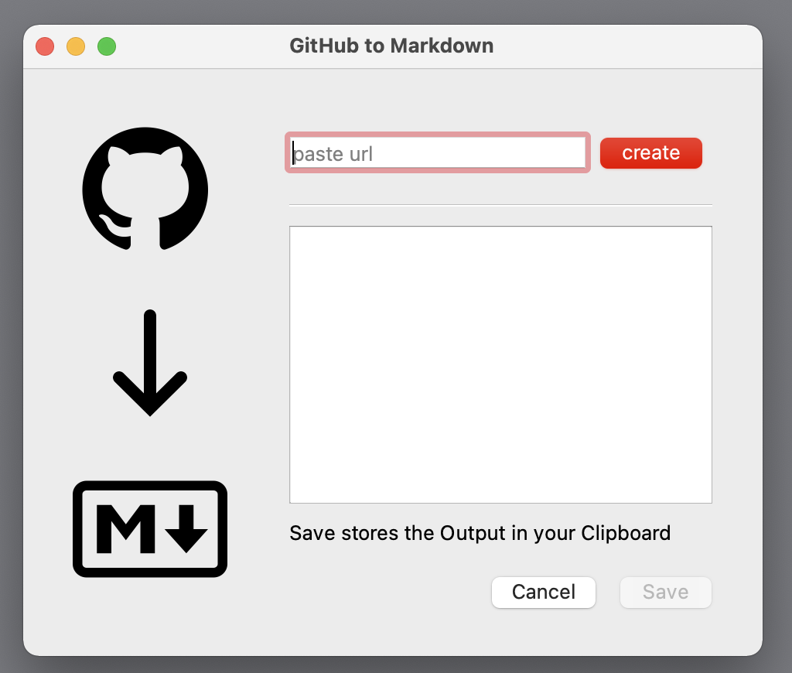

# Markdown Embedder

# Markdown Embedder

> Did you ever just find yourself wanting to quickly reference a Github Gist or Youtube Video in your Markdown File, but didn't know how to it? **This** is the solution:

**Markdown Helper: ** a tool to quickly embed media in your Markdown Files.

If you have ever used [Notion](https://www.notion.so/), you will know their genius Embed-Options for all kind of Media. This Tool wants to help you accomplish something similar with your Markdown Files. 

**For Example:** you want to quickly put a **Github Gist** or Github File in your Markdown File, but Markdown does not support the embedding of Gists. Just open *Markdown Embedder*, paste the link and it will output the File as a code fence and syntax highlighting, save it to your Clipboard and you can just embed it in your Markdown.

The App consists of **2 Windows**

| Part                  | Explanation |
| --------------------- | ----------- |
|  | **Main Window:** This is the main window of the *Markdown-Embedder App*. Clicking on a button opens up a dialog. Current Services supported are `Vimeo`, `Youtube` ,`Twitter`, `Google Drive / Docs`, `Online PDFs` `Normal Websites`, `JSFiddles`, `Codepens` and `Github Files or Gists`. You can also access all services from your Menu Bar |
|  | **Dialog:** The Dialog window is where you paste your URL. If you now just press Enter, and your embed code is generated automatically. If you now press Enter again, the code is copied to your Clipboard and you get a message from the App. |

---

Here is an Example embedding a Github File via its URL in [Typora](typora.io) 

If you have any questions, dont hesitate to message me :smiley: 

